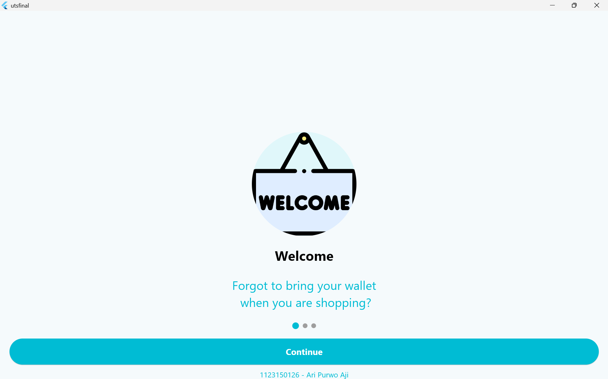
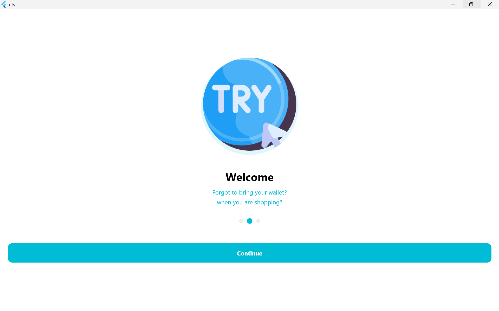
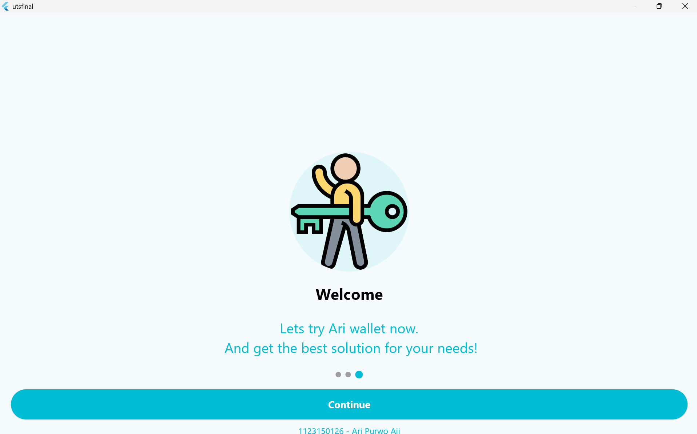

# utsfinal

A new Flutter project.

## Getting Started

This project is a starting point for a Flutter application.

A few resources to get you started if this is your first Flutter project:

- [Lab: Write your first Flutter app](https://docs.flutter.dev/get-started/codelab)
- [Cookbook: Useful Flutter samples](https://docs.flutter.dev/cookbook)

For help getting started with Flutter development, view the
[online documentation](https://docs.flutter.dev/), which offers tutorials,
samples, guidance on mobile development, and a full API reference.
### screenshoot





## 👤 Identitas
**Nama:** Ari Purwo Aji  
**NIM:** 1123150126  

---

## 📱 Deskripsi
Project ini merupakan aplikasi sederhana berbasis Flutter yang menampilkan beberapa halaman *Splash Screen* dan halaman *Sign In*.

---

## 🚀 Cara Menjalankan Project
1. Pastikan sudah menginstal **Flutter SDK**.  
2. Clone repository ini:
   ```bash
   git clone https://github.com/AriPurwoAji/KB1179_1123150126_uts.git